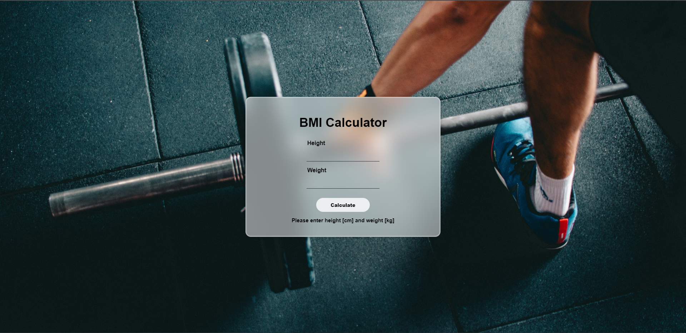

## BMI Calculator

### 🤓About BMI
<p>Body mass index (BMI) is a person’s weight in kilograms divided by the square of height in meters. BMI is an inexpensive and easy screening method for weight category   — underweight, healthy weight, overweight, and obesity.</p>
<p>BMI does not measure body fat directly, but BMI is moderately correlated with more direct measures of body fat. Furthermore, BMI appears to be as strongly correlated with various metabolic and disease outcome as are these more direct measures of body fatness.</p>

### 🤓How is BMI used?
<p>BMI can be a screening tool, but it does not diagnose the body fatness or health of an individual. To determine if BMI is a health risk, a healthcare provider performs further assessments. Such assessments include skinfold thickness measurements, evaluations of diet, physical activity, and family history.</p>

### 🤓How is BMI calculated?
`Formula: weight (kg) / [height (m)]2`<p>With the metric system, the formula for BMI is weight in kilograms divided by height in meters squared. Because height is commonly measured in centimeters, divide height in centimeters by 100 to obtain height in meters.</p>

### 🤓How it is interpreted?
<table>
  <tr>
    <td>Below 18.5</td>
    <td>Underweight</td>
  </tr>
  <tr>
    <td>18.5 - 24.9</td>
    <td>Healthy Weight</td>
  </tr>
  <tr>
    <td>25 - 29.9</td>
    <td>Overweight</td>
  </tr>
  <tr>
    <td>Above 30</td>
    <td>Obese</td>
  </tr>
</table>

### 🤓Landing Page:


<hr>

```javascript
if (youEnjoyed) {
    starThisRepository();
}
```

